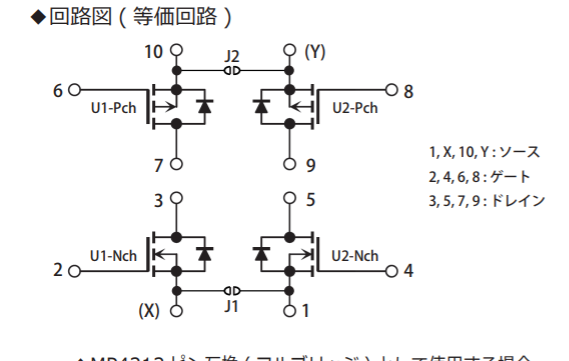

# 簡単なロボットプログラムを作ろう

## 目次

[TOC]

## はじめに

### 対象

C言語の

- for
- if else 文
- int float bool変数
- リスト
- 関数

がわかってる人向けです。

### 作って欲しいもの

```c
int state=0;
void setup() {
// 通信用設定(Serial)
}

void loop() {
  
//  通信処理
//  ロボット付属のボタン処理
  if(state==0){
//    停止処理
  }else if (state==1){
//    ライントレースで駆動
  }else if (state==2){
//    段差超え
  }else if (state==3){
//    ボール確保
  }
}

void drive_motor(duty,port){
// モータ処理 duty:1~0 のfloat。パワーの指定。 port:制御するモータの指定
}

void drive_under(rad,speed_max){
//  4輪処理 モータ処理を利用する。角度指定で動作させる。(足回りの型によって計算式が異なる)
}


void input_lt(){
//  ライントレースセンサ処理
//return どのセンサが反応したかを返す。
}

```

あと、いいと思ったらステートマシン(状態遷移図)を作成してみるといい設計ができると思います。


### これからやること

1. プログラム構造を学ぶ ＆ 設計する

2. それぞれの関数を制作する

   ここでは、モータとライントレースとコントローラを紹介します。めんどくさくてリンクだけにするかも

3. 実際に動作させ、調整する

## プログラム構造

プログラムを書く上で、考えることです

### ステート変数

ステートというのは状態という意味です、状態を表す変数を置くように心がけましょう。

Arduino IDE では、ループ関数が設けられていますよね。ロボットプログラムは常に何かしらの処理をループさせています。


#### LEDチカチカ

LEDチカチカならば、光る/消す を繰り返すわけです。

その場合は、LEDの状態を変数を用意して記憶させ、条件分岐させると思います。

#### スイッチによりチカチカ

この場合は、スイッチの状態をループで毎回読み取って、条件分岐させますね。

#### 実際のロボット

スイッチによりチカチカをもっともっと複雑で、いろんな処理が入ることになります。
そうなると、プログラムがとても見にくくなるのです。同じ処理がしたい場合も出てくるでしょう。

### やること

こんなかんじに、やること別に処理を分けて、わかりやすくします。

```c
int state=0;
void setup() {
}

void loop() {
//  通信処理
//  ロボット付属のボタン処理  手動でstateを切り替え テスト走行や、リトライに役立つ。
  if(state==0){
//    停止処理
  }else if (state==1){
//    ライントレースで駆動
//    目標に到達したらstate=2,エラーが生じたらstate=0
  }else if (state==2){
//    段差超え
  }else if (state==3){
//    ボール確保
  }
}
```

`int state`変数 をグローバル化しています。
**通信処理**,**ボタン処理**,センサ処理,などで,このstateを変えて、次の動作に進んだり、停止したりできます。

## 関数の作成

### やること

各処理の中で、繰り返すものを関数としておいてください。
考えられるものをいかに挙げておきます。

```c
void drive_motor(duty,port){
// モータ処理 duty:1~0 のfloat。パワーの指定。 port:制御するモータの指定
}

void drive_under(rad,speed_max){
//  4輪処理 モータ処理を利用する。角度指定で動作させる。(足回りの型によって計算式が異なる)
}


void input_lt(){
//  ライントレースセンサ処理
//return どのセンサが反応したかを返す。
}
```

## それぞれの処理を作成する

### 通信処理

必要なことは２つです

- 初期設定を セットアップ関数(void setup)に書き込む
- ループ関数で**入力バッファ**にあるものを読み込む

#### 入力バッファ

こんな感じです


### モータ動作

モータの動作について、表のところを参考にします。

[Hブリッジドライバの仕組み](https://elchika.com/article/14bfedd4-45ef-4db5-8842-eea2a38746df/#h_%E3%83%96%E3%83%AA%E3%83%83%E3%82%B8%E5%9B%9E%E8%B7%AF)

Arudinoから2ピン出力して、モータを制御するわけであります。


回路の子に、以下のICを用いて同じ回路を作ってもらいます。

[利用するIC](https://akizukidenshi.com/catalog/g/gK-10721/)




#### PWM

モータの出力の調整を行います。
LEDの調光と同じ原理。

[LEDの調光](https://qiita.com/mat-MUNET/items/1ef0affa49b1177815eb )

### ライントレース

赤外線を照射できるLEDと、赤外線を検知できるセンサを組み合わせます。

[ライントレース](http://www.cct.ac.jp/mech/yume2/yume2.htm)

[使う赤外線センサ](https://akizukidenshi.com/catalog/g/gI-05463/)

